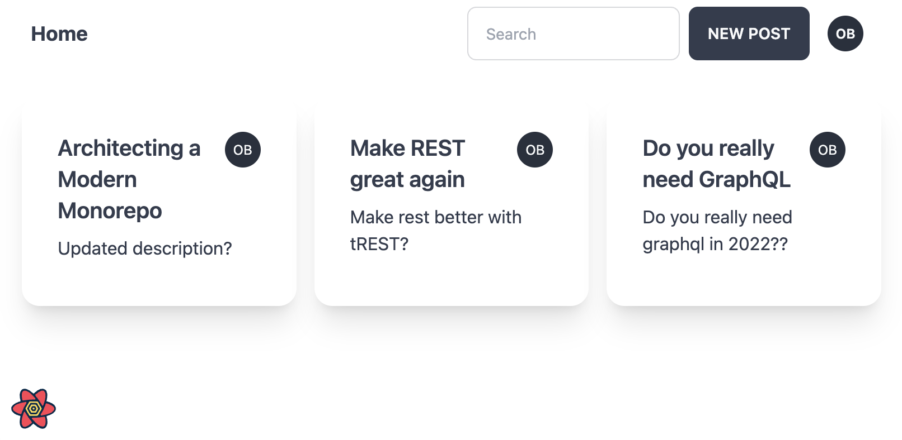

# Examples

## Pokemon - External API

This example uses an external API, out of our control with ts-rest.

See the example [here](https://next-example.ts-rest.com/)!

## Hacker News - Solid Start

This example uses Solid Start with the `@ts-rest/solid-query` package to fetch data from the Hacker News API.

See the example [here](https://example-solid-start.vercel.app/)!

## Blog - Next.js CRUD

Full fledged CRUD example and can be found here [blog example](https://github.com/ts-rest/ts-rest/tree/main/apps/example-next)

