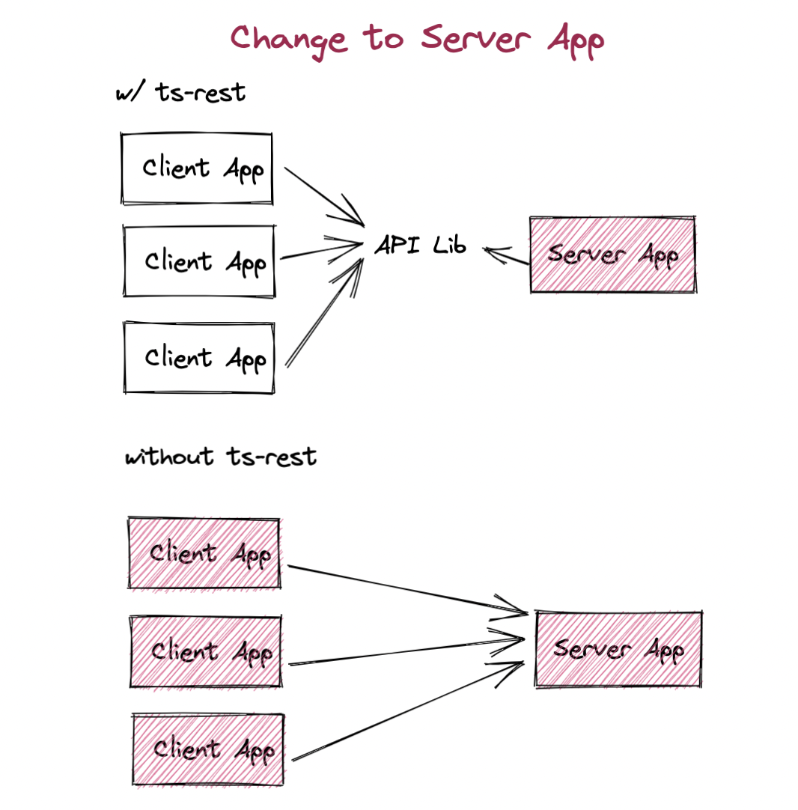
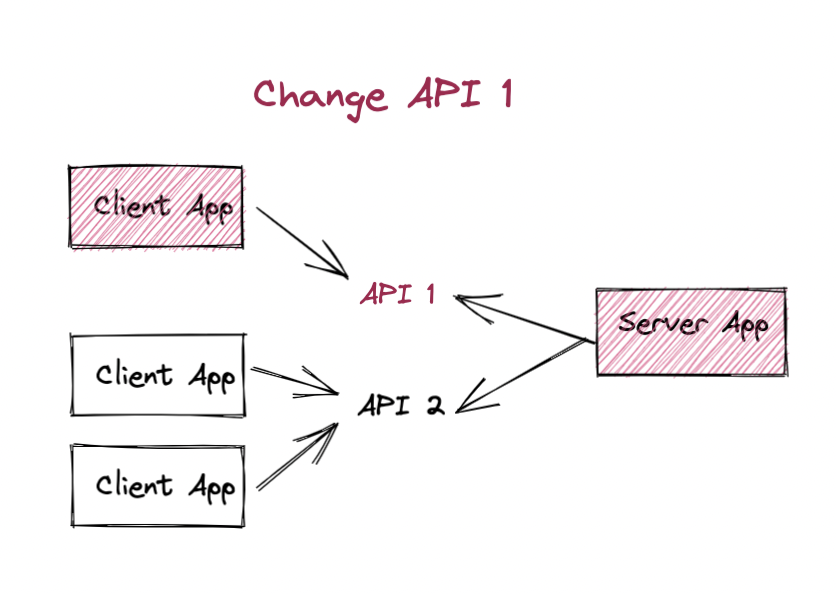

# Usage in an NX monorepo

Read about some [NX Basics](https://oliverbutler.uk/blog/architecting-a-modern-monorepo) here on [oliverbutler.uk](https://oliverbutler.uk)

## Why?

NX is a smart build system to help you and your teams build, test, and deploy your projects in a modern monorepo. @ts-rest is the perfect pairing for NX, allowing you to build fully type-safe APIs with little effort.

## Declaring an API Lib

Using ts-rest you declare a contract as a separate lib, which is shared between applications.

This is because we want to enable NX to correctly mark projects as affected, thus enabling NX to only lint/test/build/deploy the affected projects.

## Affected Builds

In a situation where you've only updated the server, having the API as a lib will only rebuild the backend, not any of its consumers.

Without a separate lib, NX will always rebuild the dependencies, in this case, the whole frontend - unnecessarily.

### Optimising Even Further

You can further improve this model when you have many consumers per API. It's possible to split the API into multiple libs, allowing you to reduce the blast radius of any changes.

## Example Library

Below is an example of a contract in a shared lib, shared between many libraries (in the ts-rest example repo)

